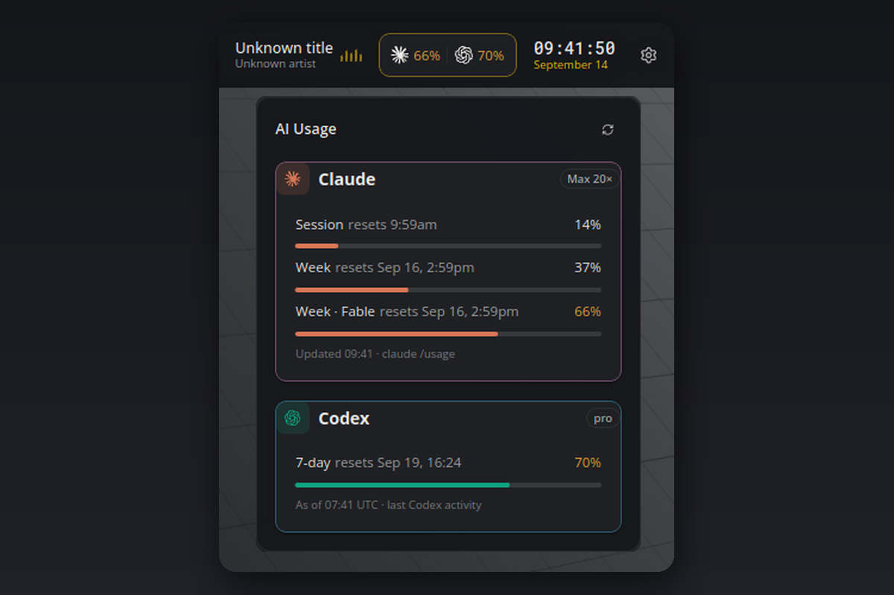

# AI Usage

Claude Code and Codex quota usage at a glance, read straight from the CLIs already on your machine. No API keys, and nothing leaves your computer.

## What you see

- **Tile:** one column per installed agent, showing its brand mark and the highest current quota. Values turn yellow from 60 % and red from 85 %.
- **Flyout:** one card per agent with the plan badge, every limit as a meter with its reset time, and when the numbers were last read.
- **Hover:** a one-line summary per agent.

Only agents that are installed appear: Claude when the `claude` CLI or `~/.claude.json` exists, Codex when the `codex` CLI or `~/.codex` exists. Claude comes first, Codex beneath it. With only one of them installed, the other is simply not shown.

## Requirements

- [Claude Code](https://www.anthropic.com/claude-code), logged in with a subscription (Pro, Max, Team or Enterprise). Pay-as-you-go accounts have no quota to show.
- [Codex CLI](https://github.com/openai/codex), used at least once. The plugin reads the rate limits Codex stores in `~/.codex/sessions`.
- Linux, macOS or Windows. On Windows the first start installs `pywinpty` (a ConPTY bridge) automatically.

## How it works

- **Claude:** there is no headless quota command, so the plugin runs `claude /usage` in a hidden pseudo terminal, reads the rendered screen and closes it again. That takes about three seconds and happens every 15 minutes by default. The probe runs in an empty folder inside the plugin's data directory, so Claude's folder-trust prompt never touches your projects.
- **Codex:** no process is started. The newest session log already contains the last rate-limit block the server sent, and the card shows when that was.

## Settings

| Setting | Default | Meaning |
| --- | --- | --- |
| `claudeBinary` | `claude` | Path to the Claude CLI. A bare name is looked up in PATH, then in the usual install locations. |
| `claudeIntervalMinutes` | `15` | Minutes between Claude probes. The minimum is 1. |

The refresh button in the flyout reads both agents immediately.

## Privacy

Everything stays local. The plugin starts the Claude CLI and reads Codex's session files. It never contacts a server itself and never reads your API keys. A `CLAUDE_CODE_OAUTH_TOKEN` in the environment is ignored for the probe, so the CLI uses its stored login.

## Known limits

- Claude numbers are as fresh as the last probe, Codex numbers as fresh as your last Codex activity.
- If Claude Code changes its `/usage` screen, the card shows "Could not read the usage screen" until the plugin is updated.
- Windows support is implemented via ConPTY but has had less real-world testing than Linux and macOS.

## Development

`python3 test_parse.py` runs the parser and rendering self-check without a running bar.

#claude #codex #openai #quota #usage #ai #coding-agents
