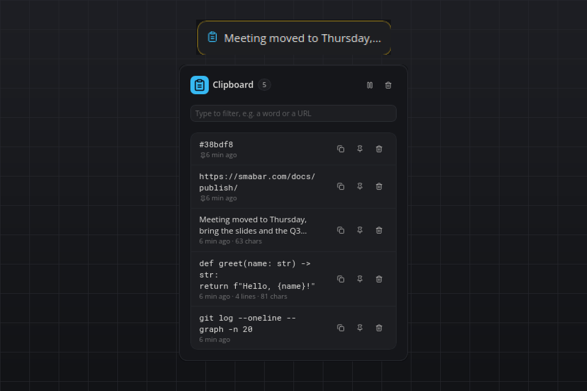

# Clipboard History

Everything you copied as text, found again in one click. The bar shows the latest entry, the flyout holds the searchable history with copy, pin and delete. Text only, local only, no API keys.

## What you see

- **Tile:** the clipboard icon and the latest entry on one line (newlines collapsed, cut at about 28 characters), `Empty` before the first copy, `Paused` with a muted pause icon while recording is off.
- **Flyout:** the entry count, a filter box that narrows the list as you type, and two header actions: Pause/Resume and Clear history (asks first; pinned entries stay). Entries are listed pinned first, then newest first. Each row shows a two-line preview, in monospace when the text looks like code, a URL or a colour, the time of the last copy and, for long texts, `N lines · N chars`. Three icon buttons per row: copy back to the clipboard, pin/unpin, delete.
- **Hover:** the latest three entries, one line each.
- **Popup:** none. The plugin never interrupts.

## Requirements

- Linux: `wl-clipboard` (`wl-paste`) on Wayland, `xclip` or `xsel` on X11. Without one of them the tile shows `Install …` and the flyout says which package is missing.
- macOS: nothing, `pbpaste` ships with the system.
- Windows: nothing, the clipboard is read through the Win32 API.

## How it works

- Every `pollSeconds` (default 1) the plugin reads the clipboard once: `wl-paste`, `xclip`, `xsel` or `pbpaste` as a short subprocess, `GetClipboardData` through ctypes on Windows. There is no background daemon and no PowerShell.
- New text goes to the top of the history. Copying something that is already in the history moves it to the top instead of adding a duplicate. Whitespace-only text and texts longer than `maxChars` are ignored.
- The history keeps `maxEntries` unpinned entries; the oldest unpinned entry falls off first. Pinned entries do not count and never fall off.
- The copy button hands the full text to the bar, which puts it on the clipboard. Copying an entry back also moves it to the top.
- Relative times in the flyout are refreshed once a minute.

Agents can drive the history over MCP with `plugin_call`: `list` (optional `query`, `limit`), `get` (full text), `pin`, `delete`, `clear` and `pause`.

## Settings

| Setting | Default | Meaning |
| --- | --- | --- |
| `pollSeconds` | `1` | Seconds between clipboard reads. 0.5 is the smallest value. |
| `maxChars` | `20000` | Texts longer than this many characters are not recorded. |
| `maxEntries` | `100` | How many unpinned entries are kept. Pinned entries do not count. |
| `paused` | `false` | Stop recording. The flyout's pause button toggles the same setting, so a pause survives restarts. |

## Privacy

- Everything stays on this computer. The plugin makes no network requests and starts no service; the only thing it reads is the clipboard.
- The history lives in the plugin's data directory, one JSON file you can inspect or delete at any time: `~/.smabar/data/clipboard-history/history.json` on Linux and macOS, `%USERPROFILE%\.smabar\data\clipboard-history\history.json` on Windows. Removing the plugin removes the file.
- Use **Pause** before copying passwords, tokens or anything else that must not be kept. Whatever sits in the clipboard when recording resumes (or when the plugin starts) is deliberately not recorded; only texts copied after that are.
- On Linux the plugin needs `wl-clipboard`, `xclip` or `xsel`. It never installs anything itself.
- Only text is recorded. Images, files and other clipboard formats are ignored.

## Known limits

- Polling means a text that is copied and replaced within one poll interval is missed.
- The filter box searches the rows in the flyout; a history with very many very long entries renders only what fits into the bar's message limit (about 700 KB of rows) and says how many older entries are not shown.
- Windows and macOS capture are implemented but were only exercised on Linux (X11 with `xsel`).
- Applications that put text on the clipboard in a non-text format only (some terminals, some password managers) are not captured. Password managers that clear the clipboard after a few seconds are captured unless you pause first.

## Development

`python3 test_history.py` runs the store and markup self-check without a running bar.

#clipboard #history #copy #paste #snippets #productivity #privacy
