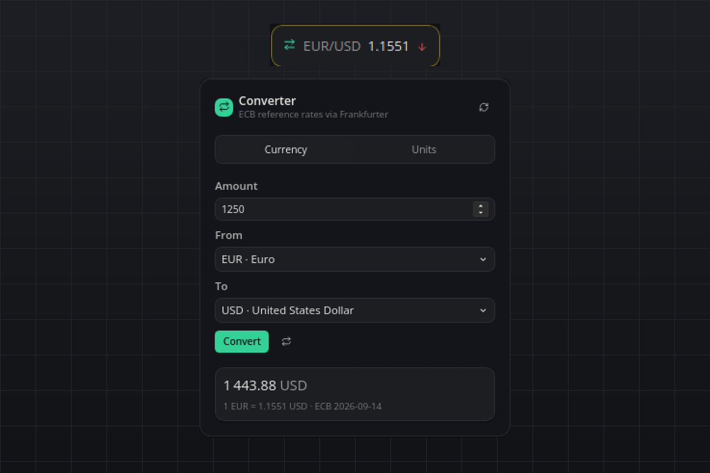
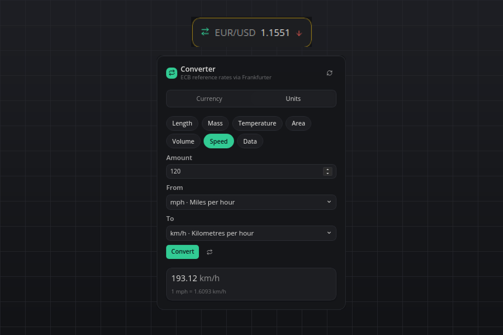

# Converter

Currency and unit conversion in one flyout, with the live rate of your favourite pair on the bar. Currencies use the European Central Bank reference rates, fetched from the free Frankfurter API. No API key.

## What you see

- **Tile:** the favourite pair and its rate, e.g. `EUR/USD 1.1551`, with a green up or red down arrow once yesterday's table is known. The tooltip carries the ECB date and the daily change. Without any rates the tile shows `EUR/USD –`.
- **Flyout:** two tabs. *Currency*: amount, from, to, a swap button, Convert, then the result in large type with the rate line beneath it (`1 EUR = 1.1551 USD · ECB 2026-09-14`). *Units*: a category chip row (length, mass, temperature, area, volume, speed, data), the same form, and the factor or formula beneath the result (`1 km = 0.6214 mi`, `°F = °C × 1.8 + 32`). Each tab remembers its last conversion, and the flyout reopens on the tab you used last.
- **Hover:** the last conversion in one line, e.g. `1250 EUR = 1443.88 USD`.

## Requirements

- Internet access for the rates; everything else is offline. Linux, macOS and Windows, Python 3.12 via the bundled runtime, no third-party packages.

## How it works

- **Rates:** `https://api.frankfurter.dev/v2/providers/ecb/rates?base=EUR` is downloaded on a background thread once per `refreshHours` (the ECB publishes once per working day). The table and the currency names from `/v2/currencies` are cached in the plugin's data directory. Offline, or when the download fails, the cached table stays on screen with its date and a muted *cached* marker; the plugin retries every 10 minutes. Without any cache the flyout says *Rates unavailable*.
- **Cross rates:** every pair is computed from the one cached table (`rate = table[to] / table[from]`), so the base currency only decides which table is fetched.
- **Daily change:** when a download brings a newer ECB date, the previous table is kept, and the tile shows the direction of the favourite pair against it.
- **Units:** pure factor tables in `units.py`, temperature through kelvin. Fluid ounce, gallon and cup are US customary; KB/MB/GB/TB are decimal, KiB/MiB/GiB/TiB binary.

## Settings

| Setting | Default | Meaning |
| --- | --- | --- |
| `baseCurrency` | `EUR` | ISO code the ECB table is fetched against. A code the ECB does not list falls back to EUR with a warning in the plugin log. |
| `favoritePair` | `EUR/USD` | Pair on the tile as FROM/TO. A malformed pair or one outside the ECB table shows EUR/USD instead. |
| `decimals` | `2` | Decimal places of results (0–10). A value the fixed places would show as 0 keeps three significant digits. |
| `refreshHours` | `12` | Hours between downloads (1–168). |

The refresh button in the flyout header downloads the table immediately.

## Agent commands

- `convert` with `amount`, `from`, `to`: currencies by ISO code (`EUR`, `usd`) or units by symbol (`km`, `kg`, `°C` or `C`, `m2`, `fl oz`, `km/h`, `GiB`). Returns the value, the rate or factor used and the rate line.
- `rates`: the cached table with base, ECB date and every rate.

## Privacy

The plugin talks only to `api.frankfurter.dev` and sends nothing but the base currency. Conversions, the cache and the flyout state stay in the local data directory.

## Known limits

- Currencies are the 30 the ECB publishes reference rates for; no crypto, no intraday rates.
- The daily change arrow appears only after the plugin has seen two ECB dates.
- Numbers use a dot as decimal separator and a thin space between thousands in every language.

## Development

`python3 test_convert.py` checks the unit math, the currency cross rates, the rendering of every state and the agent commands without a running bar.

#currency #exchange-rate #units #converter #ecb #metric #imperial
