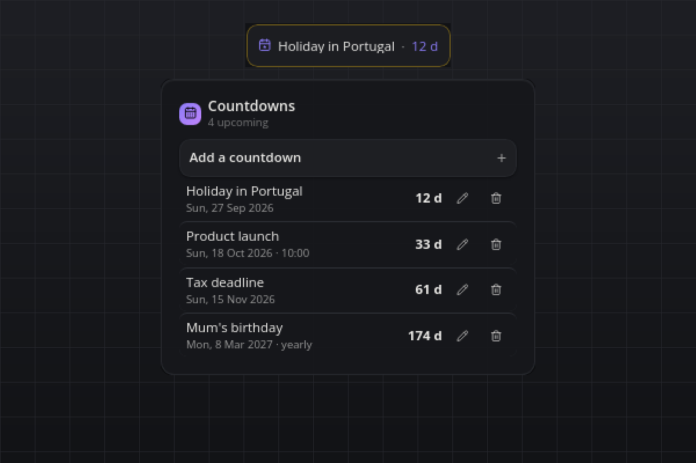

# Countdowns

Days until the things you look forward to (or dread): holidays, launches, deadlines, birthdays. Everything stays on your computer; no accounts, no API keys.

## What you see

- **Tile:** the next event and its day count, "Holiday in Portugal · 12 d". On the day it says "today!". When the event has a time and is less than a day away, the tile counts down live in hours and minutes.
- **Flyout:** a collapsible form to add a countdown (title, date, optional time, yearly switch) and the list sorted by date: title, date line, the bold day count on the right. Under 7 days the count takes the warning color, on the day the accent color. Passed one-time events stay muted for a few days, then disappear. Every row has an edit dialog and a delete button; the flyout lists `maxItems` rows and shows the rest as "+N more".
- **Hover:** the next three events, one line each.
- **Popup:** on the morning of an event, "Today: <title>" with a Dismiss button. Once per event and day.

## Requirements

- smabar with Python plugins (the bundled uv runs it on Python 3.12+). Linux, macOS and Windows.

## How it works

- Events live in `~/.smabar/data/countdowns/events.json`, written atomically.
- Days left are calendar days: the event's date minus today's local date. Clock changes (DST) never shift the count.
- Yearly events roll forward to the next anniversary once passed. A Feb 29 event falls on Feb 28 in a common year.
- Once a minute the plugin checks whether the date changed or a timed event entered its last day, and re-renders only then. The ticking hours and minutes come from the bar itself.
- The popup fires on the first check on the event's date. That date is stored with the event (`notifiedFor`), so a restart does not repeat it. While popups are muted (do-not-disturb) it tries again a minute later.

## Agent commands

`add` (title, date `YYYY-MM-DD`, optional time `HH:MM`, optional `repeatYearly`), `list` (every visible countdown with its days left and status) and `remove` (id). Discover them with `plugin_commands("countdowns")`.

## Settings

| Setting | Default | Meaning |
| --- | --- | --- |
| `keepPastDays` | `3` | Days a passed one-time countdown stays in the list before it disappears (0 to 365). |
| `maxItems` | `8` | Rows the flyout lists; the rest is shown as "+N more" (1 to 50). |
| `notify` | `true` | Show the popup on the morning of an event. |

## Privacy

Everything stays local. The plugin never contacts a server and reads nothing but its own data file.

## Known limits

- The live hours-and-minutes countdown is zero-padded ("in 03 h 20 min"); that is the bar's countdown format.
- Passed one-time events are removed from the file once they are older than `keepPastDays`; raising the setting later does not bring them back.
- Dates are calendar days in your local time zone; there is no per-event time zone.

## Development

`python3 test_countdowns.py` runs the day-math and markup self-check without a running bar.

#countdown #events #calendar #deadline #birthday #holiday #reminder
