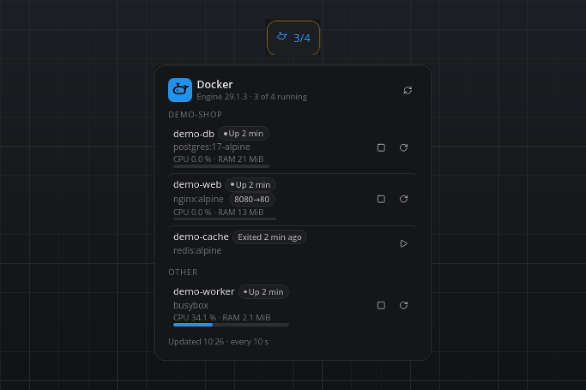

# Docker

Your containers on the bar: what runs, what stopped, which ports are published, and start, stop or restart without opening a terminal. Works with Docker Desktop, Docker Engine and Podman. No API keys, and nothing leaves your computer.

## What you see

- **Tile:** the whale and `3/5` (running of total) in the accent color while something runs, muted when nothing runs. `No containers` when the engine is empty, `Docker offline` in red when the daemon cannot be reached, `Not found` when the binary does not exist.
- **Flyout:** a heading with the engine name, its version and the running count, plus a refresh button. One section per Compose project (`Other` for standalone containers). Every row shows the name, a state badge (`Up 4 h` green, `Exited (137) 3 min ago` red, `Paused` yellow), the image, the published ports as chips (`8080→80`), and for running containers a CPU/RAM line with a slim CPU bar when stats are on. Icon buttons fit the state: stop and restart for running containers, start for stopped ones; while an action runs the row shows a spinner. When the engine goes away, the last known list stays visible muted with its buttons disabled, under a red alert with the engine's message.
- **Hover:** one line such as `3 running · web, cache, db`.
- **Popup:** only when a start, stop or restart fails: what failed and the engine's first error line, for eight seconds.

## Requirements

- Docker Desktop, Docker Engine (the `docker` CLI with access to the daemon) or Podman (`podman`), on `PATH` or as a full path in the settings.
- Linux, macOS or Windows.

## How it works

- Every refresh runs `<binary> ps -a --format '{{json .}}'` on a worker thread. When stats are on and something runs, `<binary> stats --no-stream` follows; Docker needs one to two seconds for it, so the list renders first and the numbers a moment later. The `com.docker.compose.project` label groups the rows.
- The buttons run `<binary> start|stop|restart <id>` on their own thread with a 30 s timeout; the list refreshes as soon as the command returns.
- Every start, stop and restart, whether from a button or from an agent command, is written to the plugin log with the container, its name, the source (`flyout` or `command`) and the outcome, so a change made through this plugin is always traceable.
- Podman prints a different JSON shape (names as a list, ports as mappings, labels as a map, unix timestamps instead of an `Up 4 hours` text); both shapes are normalised into the same rows. The Podman path is built from Podman's source and covered by fixtures in the test, but it has not been exercised against a live Podman installation.
- A missing binary and an unreachable daemon are logged once (not on every refresh) and shown as an alert in the flyout; the last good list stays on screen until the engine answers again.

## Settings

| Setting | Default | Meaning |
| --- | --- | --- |
| `binary` | `docker` | The container CLI: `docker`, `podman`, or a full path to one of them. |
| `refreshSeconds` | `10` | Seconds between refreshes of the container list. The minimum is 3. |
| `showStats` | `true` | Read CPU and memory of running containers on every refresh. Off saves the one to two second stats call. |

## Agent commands

- `list` returns the containers as last read: state, age of that state, exit code, health, ports, Compose project and, with stats on, CPU and memory.
- `start`, `stop` and `restart` take `{"container": "<name or id>"}`, run the engine command and wait for its answer (up to 30 s). `plugin_call` itself waits 10 s: a container that ignores SIGTERM makes `stop` and `restart` take Docker's full 10 s grace period, so the call can report a timeout although the command completes. Call `list` to see the result.

## Privacy

Everything stays local. The plugin runs the container CLI and reads its output. It never contacts a server and never reads the images, volumes or environment variables of your containers.

## Known limits

- Removing containers, images or volumes is out of scope; use the CLI or your desktop app.
- Paused containers offer stop and restart. Docker's `start` refuses a paused container and `unpause` is not exposed.
- Exposed-only ports without a host binding (for example `3306/tcp`) are not shown as chips.
- Podman support has not been tested against a live installation (see above).

## Development

`python3 test_engine.py` runs the parser, port formatting, grouping and markup self-check without a running bar.

#docker #podman #containers #compose #devops #developer #local
