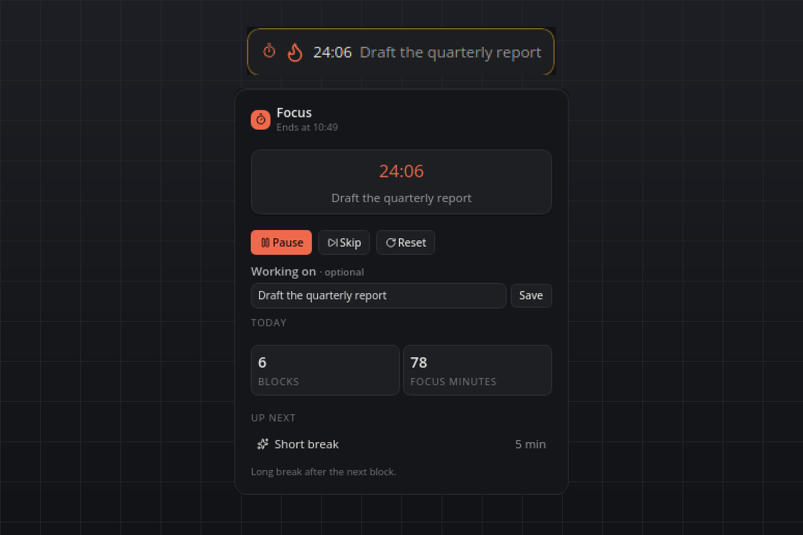

# Focus Timer

A Pomodoro timer that lives on the bar: focus blocks, short breaks, and a long break after every fourth block. When a phase ends you get a popup with the next step and a soft chime. Everything stays on your machine, and your coding agents can drive it too.

## What you see

- **Tile:** the phase glyph and the remaining time, ticking every second. A flame in the plugin accent means focus, a green sparkle or moon means a short or long break, a pause sign means paused. While you focus, your label scrolls beside the time. Idle, the tile just reads "Focus" plus how many blocks you finished today.
- **Flyout:** the phase name and when it ends, the big countdown with your label, Start / Pause / Resume with Skip and Reset beside it, the "Working on" field, today's blocks and focus minutes, and what comes next.
- **Hover:** one line, for example "Focus · 12:34 left · 3 blocks today".
- **Popup:** "Focus done — take a break" (or "Break over — back to focus") with Start, Skip break and +5 min. It stays for two minutes; any action in the flyout closes it earlier.

## Requirements

- smabar with Python 3.12 or newer (bundled). No third-party packages, no API keys, no network.
- Linux, macOS or Windows.

## How it works

- Nothing runs on its own after a phase ends: the next phase waits pending until you press Start. Skipping a running phase keeps the next one running; skipping a paused one leaves it waiting. Skipped blocks are not counted.
- The state (phase, end time, paused remainder, today's counters, label) is written atomically to the plugin's data directory after every change. On start the plugin reconciles: a phase whose end passed while the bar was away is counted once, and the next phase waits pending, without popup or chime.
- The countdown digits are ticked by the bar itself (`data-sb-countdown`); the plugin only checks once a second whether a running phase has ended and renders on real changes.
- The chime is generated once on first start with the standard library (`wave`): a soft two-tone E5/A5, 0.6 s, 44.1 kHz, 16-bit, faded out.
- Today's counters reset when the local date changes.

## Settings

| Setting | Default | Meaning |
| --- | --- | --- |
| `focusMinutes` | `25` | Length of a focus block (1–180). |
| `shortBreakMinutes` | `5` | Length of a short break (1–60). |
| `longBreakMinutes` | `15` | Length of the long break (1–120). |
| `longBreakEvery` | `4` | A long break follows every this many focus blocks (1–12). |
| `sound` | `true` | Play the chime when a phase ends. |

A changed length applies to the phase that is waiting to start; a running or paused phase keeps the length it started with.

## Agent commands

`start` (optional `minutes` 1–180 and `label`, fails while a phase is running), `pause`, `resume`, `skip`, `stop` and `status`. Every command returns the same status object: phase (`idle`, `focus`, `short_break`, `long_break`), `running`, `remainingSeconds`, `endsAt`, `label`, `completedToday` and `focusMinutesToday`.

## Privacy

Everything is local. The plugin writes `state.json` and `chime.wav` into its own data directory and contacts nothing.

## Known limits

- Timers do not run while smabar is closed; on the next start the elapsed phase is counted and the next one waits.
- A block skipped or reset before its end adds nothing to today's totals.
- The tile shows the label only while a focus block is running; long labels scroll.

## Development

`python3 test_timer.py` checks the state machine (phase transitions, the long break after four blocks, pause and resume, reconciliation of a past end time, the day rollover) without a running bar.

#pomodoro #focus #timer #productivity #breaks #countdown #deep-work
