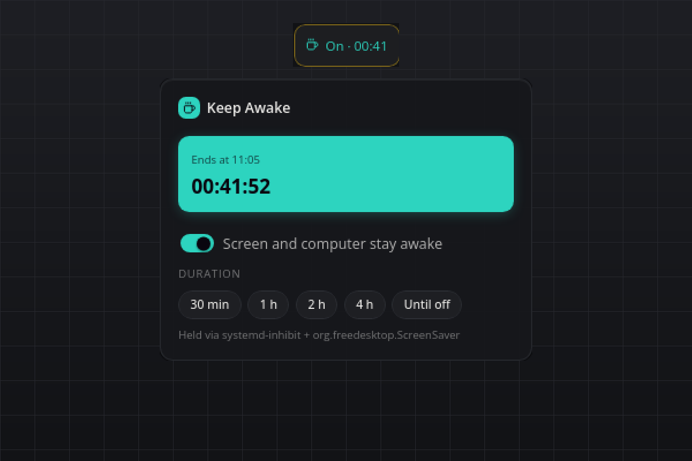

# Keep Awake

One switch that keeps the screen on and the computer from sleeping, for a presentation, a long download or a build. No API keys, nothing leaves your computer.

## What you see

- **Tile:** a coffee cup with "Off" while nothing is held, "On" in the accent colour while it is. A timed session shows the remaining time as `hh:mm`, ticking down without a single re-render.
- **Flyout:** the switch, five duration chips (30 min, 1 h, 2 h, 4 h, Until off), while on a hero with the end time and a live countdown, and a muted line naming the mechanism that holds the inhibit. The chips work while off (start for that long) and while on (change the duration).
- **Hover:** "Keep Awake · on for 42 more min" or "Keep Awake · off".
- **Popup:** "Keep Awake ended" when a timed session runs out.

The plugin always starts **off**. Nothing is remembered across a restart of smabar or the plugin, so a forgotten session can never keep a machine awake for days.

## Requirements

- **Linux:** `systemd-inhibit` for sleep, plus one of these for screen idle: `gnome-session-inhibit`, the distro `python3` with PyGObject (talks to `org.freedesktop.ScreenSaver`; GNOME, Cinnamon and MATE ship it), or `xdg-screensaver` on X11. Whatever exists is used, and the flyout shows which.
- **macOS:** `caffeinate`, part of the system.
- **Windows:** nothing extra; the plugin calls `SetThreadExecutionState`.

## How it works

| Platform | Mechanism |
| --- | --- |
| Linux | `systemd-inhibit --what=idle:sleep --mode=block` as a child process, plus the first screen-idle inhibitor that comes up: `gnome-session-inhibit --inhibit idle`, then `inhibit_linux.py` (a tiny helper that registers an `org.freedesktop.ScreenSaver` inhibit and holds the D-Bus connection open), then `xdg-screensaver reset` every 50 seconds. |
| macOS | `caffeinate -dims -w <plugin pid>`: display, idle, disk and system assertions. |
| Windows | `SetThreadExecutionState(ES_CONTINUOUS \| ES_SYSTEM_REQUIRED \| ES_DISPLAY_REQUIRED)` on a dedicated thread, cleared with `ES_CONTINUOUS` on stop. |

Every inhibitor is tied to the plugin's own process: the Linux children wait for the plugin's pid (`tail --pid`), `caffeinate -w` waits for it, the Windows state dies with its thread. Switching off, a plugin reload or a graceful stop releases everything at once, and even a hard kill leaves nothing behind.

## Settings

| Setting | Default | Meaning |
| --- | --- | --- |
| `defaultMinutes` | `60` | How long a session started with the switch or the `on` command lasts. `0` keeps the computer awake until you switch it off. |

## Agent commands

| Command | Arguments | Result |
| --- | --- | --- |
| `on` | `minutes` optional, 0 to 1440 | Starts a session, or changes the duration of the running one. |
| `off` | none | Releases every inhibitor. |
| `status` | none | `on`, `remainingMinutes`, `endsAt`, `mechanism`, `error`. |

## Privacy

Everything stays local. The plugin starts a system tool or a helper process and writes no files at all.

## Known limits

- On Cinnamon `xdg-screensaver reset` does nothing while the screensaver is inactive, which is why the D-Bus helper exists. Without PyGObject only sleep is inhibited there, not screen blanking; the flyout line shows `systemd-inhibit` alone in that case.
- Lid close, the power button and a sleep you trigger yourself are never blocked.
- Windows: `SetThreadExecutionState` keeps the display and the system awake but does not stop a classic screen saver.
- macOS: the system-sleep assertion (`-s`) applies on AC power only; on battery idle sleep is still prevented.
- The Windows and macOS backends follow the official documentation; they were built and verified on Linux (X11, Cinnamon).

## Development

`python3 test_backend.py` checks the platform selection, the timer bookkeeping and the markup without a running bar and without starting any inhibitor.

#keep-awake #caffeine #sleep #screensaver #presentation #inhibit #power
