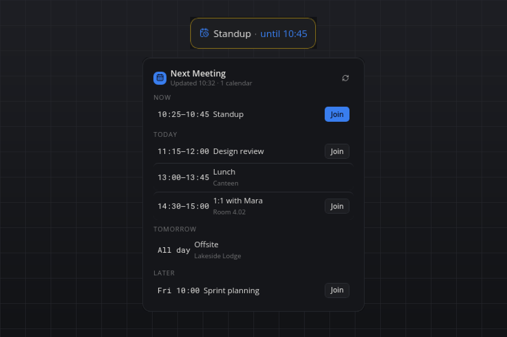

# Next Meeting

Your next appointment on the bar, read from any calendar that offers an ICS address: Google Calendar, Outlook.com and Microsoft 365, iCloud, Nextcloud, Fastmail, Proton and every other iCal feed. No OAuth, no API key, no account linking: you paste one secret address and the plugin fetches it.

## What you see

- **Tile:** the next event of today with a live countdown ("Standup · in 12 min"); while an event runs, "Standup · until 10:30" in the accent color. When nothing is left, "No more meetings today"; without a calendar, "Add a calendar".
- **Flyout:** the agenda in the sections Now, Today, Tomorrow and Later, each event with its time range (or "All day"), title, location and a Join button when a video-meeting link was found. The header shows when the calendars were last fetched and has a refresh button. A calendar that cannot be read gets a warning line ("Calendar 2: HTTP 403") while its last good events stay on screen.
- **Hover:** the next two events, one line each.
- **Popup:** a reminder a few minutes before an event starts, with Join and Dismiss. Every occurrence reminds once, also across restarts. A second popup appears once when a calendar that used to work stops refreshing.

Agents can call `meeting.next`, `meeting.list` (optional `days`) and `meeting.refresh`.

## Requirements

- A calendar with an ICS address (see below) or a local `.ics` file.
- Linux, macOS or Windows. The first start installs `icalendar` and `recurring-ical-events` through uv.

## How it works

Every configured calendar is downloaded in its own thread every `refreshMinutes` (timeout 15 seconds, at most 8 MB). The file is parsed with `icalendar`, recurring events are expanded with `recurring-ical-events` (RRULE, EXDATE and moved occurrences are honoured), every time is converted to the computer's time zone, and the occurrences from one hour ago until `lookaheadDays` ahead are cached as JSON in the plugin's data directory. The bar shows the cached agenda immediately after a start and refreshes in the background.

The Join button uses the first link in the URL, conference, location or description fields that belongs to Zoom, Google Meet, Microsoft Teams, Webex, Jitsi (meet.jit.si), Whereby, GoTo or BlueJeans; otherwise the first https link in the location.

## Settings

| Setting | Default | Meaning |
| --- | --- | --- |
| `calendars` | `[]` | ICS addresses (`https://` or `webcal://`) or paths to local `.ics` files, comma-separated in the settings panel. |
| `refreshMinutes` | `10` | Minutes between fetches. |
| `remindMinutes` | `5` | Minutes before an event the reminder popup appears; `0` switches reminders off. |
| `lookaheadDays` | `7` | How many days ahead the flyout and `meeting.list` show. |
| `showAllDay` | `true` | Whether all-day events are listed. |

## Where to find the ICS address

The wording changes now and then; look for "iCal", "ICS", "secret address" or "publish".

- **Google Calendar:** calendar.google.com → gear icon → *Settings* → pick the calendar under *Settings for my calendars* → *Integrate calendar* → copy the *Secret address in iCal format*.
- **Outlook.com and Microsoft 365 (Outlook on the web):** gear icon → *Calendar* → *Shared calendars* → *Publish a calendar* → choose the calendar and *Can view all details* → *Publish* → copy the ICS link.
- **iCloud:** icloud.com/calendar → the share icon next to the calendar → *Public Calendar* → copy the `webcal://` link. iCloud only offers a link for calendars you make public.
- **Nextcloud:** Calendar app → the three dots next to the calendar → *Share link* → copy the public link and append `?export` to it. The private link needs a login and does not work here.
- **Fastmail:** *Settings* → *Calendars* → open the calendar → *Publish* → copy the ICS URL.
- **Proton Calendar:** *Settings* → *Calendars* → the calendar's *Share* → *Share with anyone* → copy the link.

## Privacy

The ICS address is a secret: anyone who knows it can read that calendar. It is stored only in the plugin's settings on this computer, and the plugin sends requests only to the host in that address, with a plain `smabar-next-meeting` user agent. The cached agenda (titles, times, locations and links of the coming days) lives in the plugin's data directory as JSON; the address itself is not written there. Nothing goes to any other server.

## Known limits

- Calendars behind a login (HTTP basic auth, private Nextcloud links) answer with HTTP 401 and are not supported.
- The tile shows today's events only; tomorrow and later live in the flyout.
- Reminders are checked once a minute, so a popup can appear up to a minute after the configured lead time.
- Self-hosted Jitsi rooms are only recognised when their link is the event's location.

## Development

`uv run --script test_ics.py` expands a sample calendar (a weekly series with an EXDATE, an all-day event, Zoom and Teams links) in a fixed window and checks the grouping, the join-link detection and the markup, without a running bar.

#calendar #meeting #ics #ical #agenda #reminder #google-calendar #outlook #icloud #nextcloud
