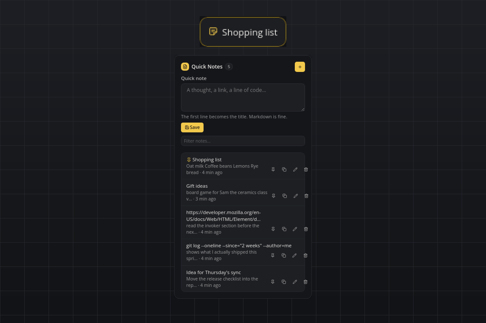

# Quick Notes

A scratchpad on the bar: jot something down in two seconds, find it again later. Every note is a plain Markdown file on your disk, so any editor or Obsidian can open the folder. No accounts, no API keys, nothing leaves your computer.

## What you see

- **Tile:** one calm line with the sticky-note icon. By default it shows the title of the pinned note (or the latest one when nothing is pinned); the `tileMode` setting switches it to always the latest note or to the number of notes.
- **Flyout:** the heading row with the note count and a "+" button for a larger editor, a quick-note textarea with Save, a filter field, and the list of notes newest first (the pinned note on top). Every row shows the title, a preview of the body, how long ago it was updated, and four icon actions: pin/unpin, copy the full text, edit in a dialog, delete.
- **Hover:** the first three lines of the pinned (or latest) note.
- **Popup:** a short "Saved" toast after saving, and a "Deleted" toast with an Undo button that stays for ten seconds.

## Requirements

- Nothing beyond smabar. Linux, macOS and Windows.

## How it works

- Each note is one file: `<data dir>/notes/<YYYYMMDD-HHMMSS>-<random>.md`. The first non-empty line is the title (Markdown headings and list markers are stripped for display); the file's modification time is the "updated" time. Files are written atomically, so an editor never sees a half-written note.
- The data dir is smabar's data directory for the plugin, `~/.smabar/data/quick-notes/` on Linux and macOS and `%USERPROFILE%\.smabar\data\quick-notes\` on Windows. Point Obsidian or any editor at its `notes` folder.
- The plugin rescans that folder every 30 seconds. Files you add, edit or remove elsewhere show up on the next scan; any `*.md` file counts as a note, its file name is the id.
- The pinned note is remembered in `pinned.json` next to the `notes` folder, so the Markdown files stay clean.
- Undo after Delete restores the file from a copy the plugin keeps in memory until the next delete or undo.

## Agent commands

Coding agents can use the plugin through smabar's MCP server (`plugin_commands("quick-notes")`, then `plugin_call`):

| Command | Arguments | Returns |
| --- | --- | --- |
| `notes.add` | `text` | `id`, `title` |
| `notes.list` | `query` (optional), `limit` (optional, default 50) | `notes[]` with `id`, `title`, `preview`, `updated`, `pinned` |
| `notes.search` | `query`, `limit` (optional) | same as `notes.list` |
| `notes.get` | `id` | the summary plus the full `text` |
| `notes.delete` | `id` | `deletedId` |

Adding and deleting through a command shows the same toasts as the flyout, so you can undo an agent's delete too.

## Settings

| Setting | Default | Meaning |
| --- | --- | --- |
| `tileMode` | `pinned` | What the tile shows: `pinned` (the pinned note's title, or the latest one), `latest` (always the newest note's title), `count` (the number of notes). |

## Privacy

Everything stays local. The plugin only reads and writes its own `notes` folder and `pinned.json`; it never contacts a server.

## Known limits

- One note can be pinned at a time; pinning another note replaces the pin.
- The filter field matches the visible title and preview; the `notes.search` command searches the full text.
- The "updated" ages in the list refresh when something changes, not every minute.
- A change to the notes folder from outside the bar re-renders the list, which closes an editor dialog that is open at that moment.

## Development

`python3 test_notes.py` runs the store, markup and state-machine self-check without a running bar.

#notes #scratchpad #markdown #obsidian #memo #clipboard #productivity
