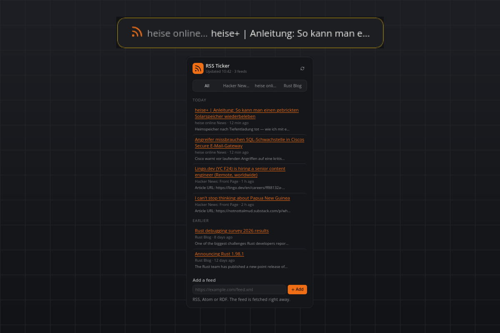

# RSS Ticker

Headlines from the feeds you choose, rotating on the bar, the full list one click away. RSS 2.0, Atom 1.0 and RSS 1.0/RDF, fetched straight from the source. No API keys, no account.

## What you see

- **Tile:** one headline at a time, the feed name muted before it, rotating through the newest headlines across all feeds (`tileItems`, five by default). A warning triangle appears when a feed could not be updated. Without feeds the tile says "Add feeds".
- **Flyout:** a heading with the time of the last update and a refresh button; tabs "All" plus one per feed (the first four); items newest first with the title as a link that opens in your browser, the feed name and relative time beneath it, and the first line of the summary when the feed has one. "All" groups the newest 30 items into Today, Yesterday and Earlier. Each feed tab has a remove button, and a field at the bottom adds a feed. A feed that could not be updated shows a warning row and keeps its last headlines.
- **Hover:** the three newest headlines, one line each.
- **Popup:** none. News never toasts.

## Requirements

- Internet access to the feeds you configure.
- Linux, macOS or Windows; no third-party Python packages.

## How it works

- Every feed is fetched in its own thread with a 15-second timeout, gzip and conditional requests (ETag / Last-Modified), so an unchanged feed costs one small 304 response.
- The parser is the standard library's ElementTree matching on local tag names, so RSS 2.0 (`item`), Atom (`entry`) and RDF (`item` under `rdf:RDF`) share one path. Dates are read as RFC 822 or ISO 8601; an item without a date gets the fetch time. Summaries are stripped of HTML and cut to 160 characters. Items without a title or without an http(s) link are skipped, and one bad feed never affects the others.
- The last result is cached in the plugin's data directory and shown immediately at start, then refreshed in the background.

## Settings

| Setting | Default | Meaning |
| --- | --- | --- |
| `feeds` | `[]` | Feed addresses. Add and remove them in the flyout or here. |
| `refreshMinutes` | `15` | Minutes between updates. The minimum is 5. |
| `tileItems` | `5` | How many of the newest headlines rotate on the tile. |
| `maxPerFeed` | `20` | Items kept per feed. |

## Agent commands

`latest` (optional `limit`), `refresh`, `add` (`url`) and `remove` (`url`). Discover them with `plugin_commands("rss-ticker")`; `latest` returns title, link, feed, published time (ISO 8601, UTC) and summary.

## Privacy

The plugin talks only to the feed servers you configure, identifying itself as `smabar-rss-ticker/1.0`. Nothing else is contacted, and the cache lives in the plugin's data directory only.

## Known limits

- Only the first four feeds get their own tab. Further feeds still appear in "All" and are removed in the plugin settings.
- Atom entries whose title or summary is XHTML (child elements instead of text) are skipped or shown without a summary.
- The tile cuts a headline at about 34 characters and shortens long feed names, so it stays a calm one-liner; the full headline is in the flyout.
- Feeds that require a login or block non-browser clients cannot be read; the feed then shows a warning row.

## Development

`python3 test_feeds.py` parses sample RSS 2.0, Atom and RDF documents and checks the refresh rules, the cache and the markup without a running bar.

#rss #atom #news #feeds #headlines #ticker #reader
