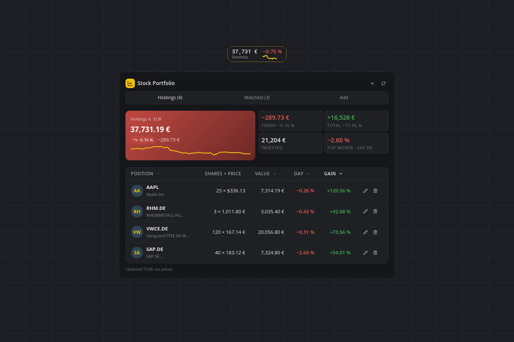
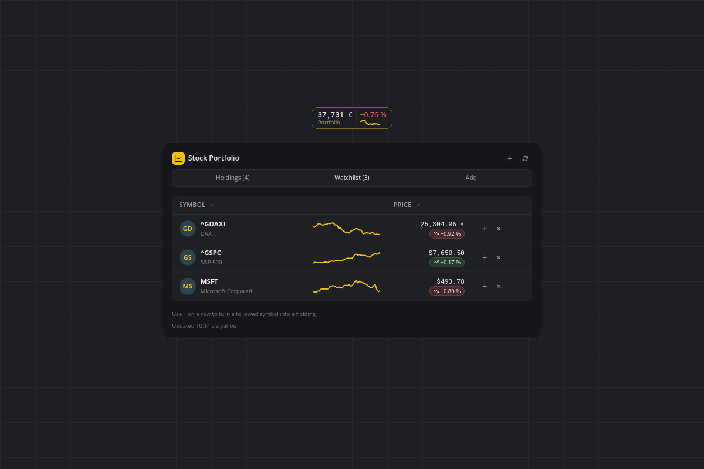
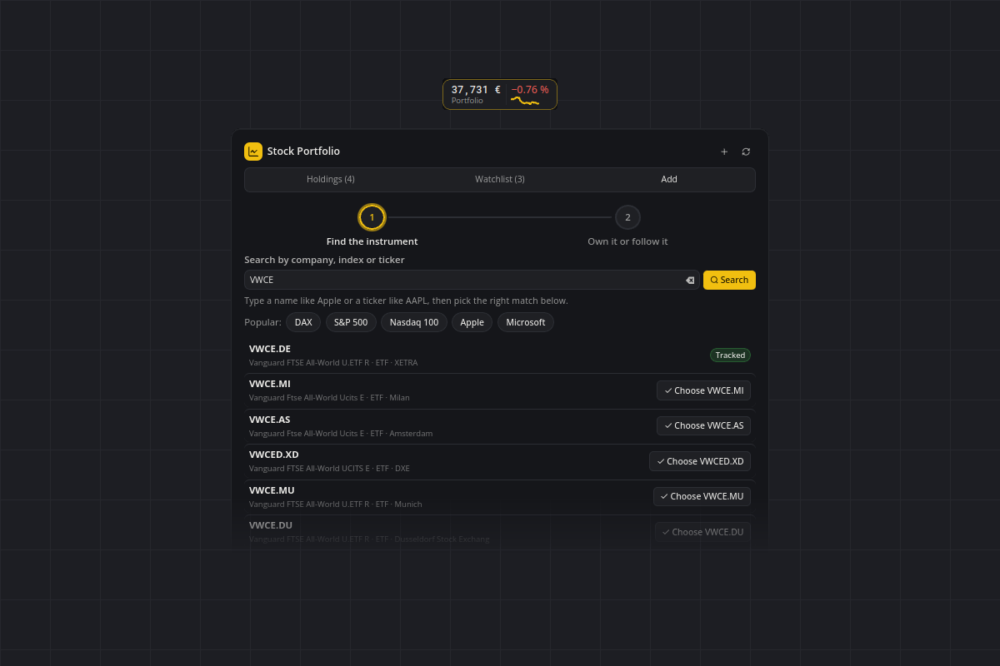

# Stock Portfolio

What your holdings are worth, right on the bar: portfolio value and day change, plus live quotes for a watchlist of stocks, ETFs and indices. Yahoo Finance by default (no account needed), Finnhub with a free key. The only connections go to the quote provider you choose.



## What you see

- **Tile:** the portfolio value with its day change in one of four cover layouts (`statSplit`, `dualText`, `segmentHeader`, `basic`). `statSplit` draws the value curve of your last updates next to the change; until there are enough updates it shows the absolute day move instead. Optionally the tile rolls through the total and every tracked symbol.
- **Flyout:** three tabs with counts in their labels.
  - *Holdings* — a hero that follows the day: green on a gaining day, red on a losing one, with the value, the change as a badge and in money, and the value curve. Four KPIs beside it: today, total gain, invested, and the top mover of the day. Below, the table with initials avatar, shares × price, value, day and gain, sortable by column, with edit and remove per row (also in the right-click menu). Without holdings there is an empty state with a button straight into the Add tab.
  - *Watchlist* — a table of quotes without a holding: symbol, intraday sparkline, and the price with its day change beneath. The **+** on a row turns a followed symbol into a holding.
  - *Add* — two steps: find the instrument (search, or one tap on DAX, S&P 500, Nasdaq 100, Apple, Microsoft), then decide: **Add to portfolio** with a number of shares, or **Only follow it**. While the search runs, placeholder rows stand in; a search without a match shows an empty state, not an error. A plugin with nothing tracked opens on this tab.





- **Hover:** a compact list with the totals and every tracked symbol.
- **Popup:** an optional alert when a symbol moved past a threshold you set (`alertPercent`).

## Requirements

- smabar 1.4.0 or newer (`protocolVersion` 1). Python and the smabar SDK come with the app; the plugin needs no third-party packages.
- An internet connection for the quotes.
- Optional: a free [Finnhub](https://finnhub.io) API key, see below.

## How it works

| Provider | Key | Properties |
| --- | --- | --- |
| `yahoo` (default) | none | `query1.finance.yahoo.com/v8/finance/chart/<symbol>`, the endpoint the Yahoo Finance website uses itself. Price, previous close, currency, intraday points for the sparklines and, via `<CURRENCY><BASE>=X`, the exchange rates. |
| `finnhub` | yes, free | `finnhub.io/api/v1`, documented, 60 requests per minute on the free tier. `GET /quote` returns price and previous close. No history and no FX on the free tier: the sparkline is built from the plugin's own polls, and foreign-currency holdings stay out of the total. |

**About `yahoo`:** Yahoo retired its official API in 2017; this endpoint is undocumented and can change without notice. It is rate-limited per IP (HTTP 429). The plugin sends exactly one request per symbol and update, pauses 0.25 s between them and tracks at most 25 symbols; on 429, raise `refreshMinutes`. The request carries a browser-like `User-Agent`, because the host answers the Python default with 429. All of this is visible in `providers.py`.

**Finnhub key:** the key is stored neither in the settings nor in this repository, but in a file you create yourself:

```
~/.smabar/data/stock-portfolio/finnhub_token.txt
```

(Windows: `%USERPROFILE%\.smabar\data\stock-portfolio\finnhub_token.txt`). One line, just the key. The folder exists after the first start; writing there does not restart the plugin. Without the file the flyout shows a hint instead of quotes.

## Settings

Holdings and the watchlist are edited in the flyout. The rest lives in Settings › Plugins.

| Setting | Default | Meaning |
| --- | --- | --- |
| `positions` | `[]` | Your holdings: symbol, shares, optional average purchase price. The Add tab is the editor. |
| `watchlist` | `^GDAXI`, `AAPL` | Symbols quoted without a holding. |
| `baseCurrency` | `EUR` | Currency of all totals. Foreign holdings are converted with the provider's FX rate (Yahoo only). |
| `provider` | `yahoo` | `yahoo` or `finnhub`. |
| `refreshMinutes` | `5` | Minutes between price updates. The minimum is 1. |
| `alertPercent` | `0` | Threshold for the price popup in percent; `0` disables it. There is no other rate limit for popups, so this threshold is the frequency control. |
| `coverLayout` | `statSplit` | How the tile shows the portfolio. |
| `tileRotate` | `true` | Roll the tile through the total and every tracked symbol. |

Symbols are the provider's own: `AAPL`, `SAP.DE`, `VWCE.DE`, indices with a caret (`^GDAXI`, `^GSPC`). London quotes arrive in pence and are normalised to pounds.

## Agent commands

`portfolio_summary` returns the portfolio total, the day change, the total gain and every position in the base currency as JSON. Read-only; the numbers are as fresh as the last successful update.

## Privacy

Everything writable lives in `~/.smabar/data/stock-portfolio/`: `market.json` with the last quotes, exchange rates, value history and alert anchors (written to a temporary file and swapped in, so an interrupted write never leaves half a file), and `finnhub_token.txt` only if you create it. Holdings and the watchlist are part of smabar's plugin settings. There is no telemetry; the only outgoing requests go to the chosen quote provider. Removing the plugin removes its data folder.

## Known limits

- Quotes are delayed depending on provider and exchange; this is not real-time data.
- At most 25 symbols at a time.
- The total gain counts only holdings with a purchase price; holdings without an exchange rate stay out of the total and are named in the flyout.
- The value curve starts when the plugin is installed and holds the last 60 updates; there is no look back at earlier days.
- No dividends, fees, taxes or splits.
- The count-up animation of the tile numbers is off for the German number style, because the shell's parser would read the decimal comma as the end of the number.

## Development

`python3 -m unittest discover -s tests` runs the offline tests without a running bar: portfolio maths, currency conversion, validation of broken settings, formatting in both languages and the rendered markup against the sanitizer's allowlist.

Not investment advice. The numbers shown can be wrong, stale or incomplete; do not base trading decisions on them alone.

#stocks #portfolio #finance #watchlist #etf #index #yahoo #finnhub
