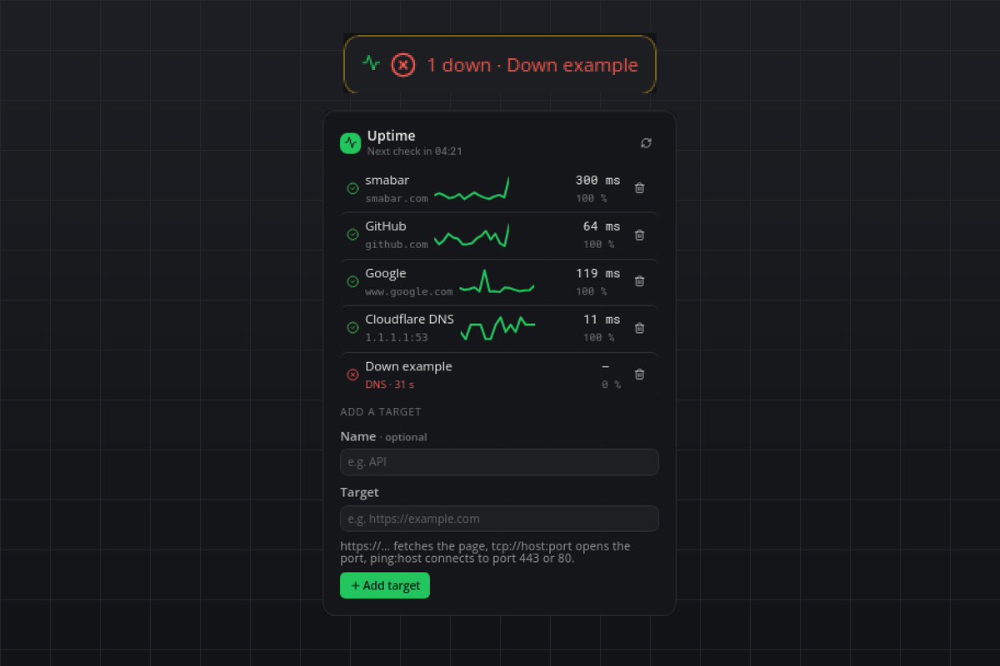

# Uptime

Is it up? Your own sites, servers and services, checked from your machine every minute, with a popup the moment one goes down and another when it is back. No account, no API key, nothing leaves your computer except the checks themselves.

## What you see

- **Tile:** `8/8 up` in green with a check mark, or `1 down · api` in red with the names of the targets that fail. Without targets it says "Add targets".
- **Flyout:** the next-check countdown and a Check now button in the header; one row per target with its status icon, name and host, a sparkline of the recent latencies, the latest latency and the uptime percentage, and a Remove button. A down row shows the reason instead of the host: `HTTP 503`, `timeout`, `DNS`, `refused`, `TLS`, plus how long it has been down. Below the list a small form adds a target.
- **Hover:** one line per target with its latency or its failure reason, at most five.
- **Popup:** `Down: api (HTTP 503)` after the configured number of consecutive failures, `Back up: api after 4 min` on the first success afterwards. Both carry a Check now button. The first round after a start never pops up; it only shows the state.

## Targets

One entry per target, as `Name | target` or just the target. The name defaults to the host.

| Form | What is checked | Up when |
| --- | --- | --- |
| `https://…` / `http://…` | A GET request with a `smabar-uptime` User-Agent, following redirects; the body is not downloaded | the final status is below 400 |
| `tcp://host:port` | A TCP connection to that port | the connection opens |
| `ping:host` | A TCP connection to port 443, then 80 | one of the ports opens |

`ping:` does not send ICMP: raw sockets need privileges on every platform, so the plugin connects to the two ports almost every host answers on. A host that blocks both counts as down.

HEAD requests are deliberately not used because many hosts reject them.

## How it works

- Every `intervalSeconds` all targets are checked at once in a small thread pool, each with a `timeoutSeconds` limit; the latency is the full round trip.
- Each target keeps a ring buffer of the last `historySize` results (time, ok, latency, code). The uptime percentage is the share of successful checks in that buffer; the sparkline plots the latency of the successful ones.
- A target becomes down after `failuresBeforeDown` consecutive failures and up again on the first success. The state change time is kept, so "back up after 4 min" measures the whole outage from its first failed check.
- The buffers and states are written atomically to `state.json` in the plugin's data directory after every round, so a restart shows the last known state immediately.

## Agent commands

`status` lists every target with state, latency, uptime and the time of its last state change. `check` runs a round now (optionally for one target by name) and returns the results. `add` (`name` optional, `target`) and `remove` (`name`) edit the target list; they validate the target form and refuse duplicates.

## Settings

| Setting | Default | Meaning |
| --- | --- | --- |
| `targets` | `[]` | The targets, one string each: `Name \| target` or just the target. The flyout edits this list. |
| `intervalSeconds` | `60` | Seconds between rounds; the minimum is 15. |
| `timeoutSeconds` | `5` | Seconds a single check may take before it counts as a timeout. |
| `failuresBeforeDown` | `2` | Consecutive failures before a target is down and the popup appears. |
| `historySize` | `60` | Checks kept per target for the uptime percentage and the sparkline. |

An entry the plugin cannot parse is skipped and listed in a warning at the top of the flyout.

## Privacy

The plugin only ever contacts the targets you configure, from your machine, with a User-Agent that names the plugin. Results stay in the plugin's data directory.

## Known limits

- Checks run from this computer: a target that is down for you may be fine for others, and a sleeping laptop checks nothing.
- `ping:` is a TCP connect, not ICMP.
- HTTP checks look at the status code only; a page that answers 200 with an error message counts as up.
- Latency includes DNS resolution and the TLS handshake.

## Development

`python3 test_checks.py` runs the parser, ring buffer, state machine and markup self-check without a running bar and without network access.

#uptime #monitoring #status #ping #http #latency #alerts #self-hosted
